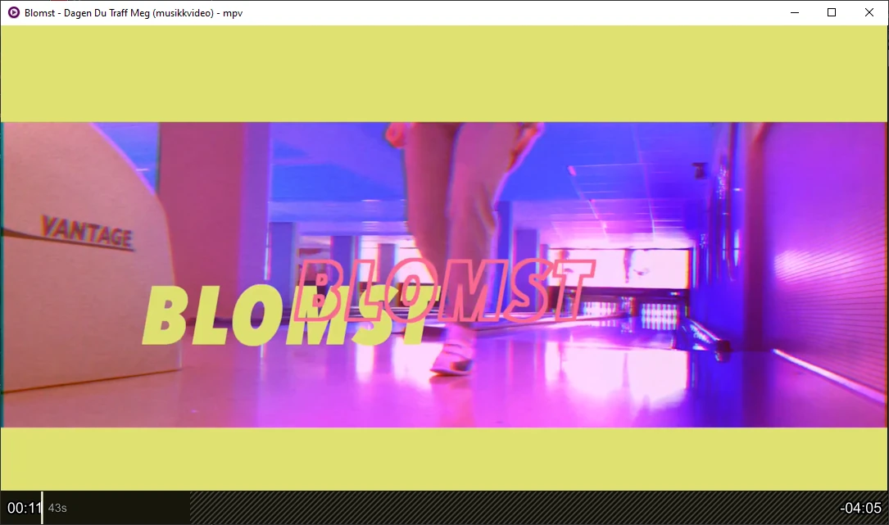

# youtube-upnext
A userscript for MPV that allows you to load the up next/recommened youtube video on the fly, as though you were using the web player.


Toggle the menu with `ctrl+u` (configurable). Select from the list with the arrow keys (configurable), and press `Enter` (configurable) to select. Menu times out after 10 seconds (configurable).

Press `Space` to append to the playlist. Close menu with `Escape` or `ctrl+u`.

## Installation

Copy youtube-upnext.lua into your scripts directory, e.g.:

    cp youtube-upnext.lua ~/.config/mpv/scripts/

optional, copy the config file:

    cp youtube-upnext.conf ~/.config/mpv/script-opts/


Make sure you have cURL or GNU Wget installed.
cURL is included in Windows 10+, macOS, Android and many Linux distributions.

### Windows:

The location of the scripts directory on Windows is `%APPDATA%\mpv\scripts` e.g. `C:\Users\cvzi\AppData\Roaming\mpv\scripts`

$\textcolor{#D00000}{\textsf{Microsoft ships an old version of cURL with known vulnerabilities.}}$
You are encouraged to install a newer version of cURL:

Get the official cURL. releases at [cURL.se](https://curl.se/windows/).
[git for windows](https://git-scm.com/) includes a version of cURL.

If you downloaded/installed the curl/wget executable, you have to [add the directory of the curl.exe/wget.exe to your machine's
%PATH%](https://stackoverflow.com/a/41895179/10367381).

### [uosc](https://github.com/tomasklaen/uosc) menu integration

If you want to add the upnext menu to **uosc**, you need to add one of the following line to your `input.conf`.
If you use the line starting with `#` it just creates an entry in the uosc menu.
If you use the second line, it also creates a keyboard shortcut to open the menu.
Replace `u` with the key of your choice:

```
#           script-message-to youtube_upnext menu     #! Youtube Recommendations
OR
u           script-message-to youtube_upnext menu     #! Youtube Recommendations
```

If you want it to appear in a submenu, replace `Youtube Recommendations` with e.g. `Utils > Youtube Recommendations`


Note: If you're using the default menu of uosc and you don't have the uosc menu defined in `input.conf`, you first need to create
a menu configuration. You can find an example at https://github.com/tomasklaen/uosc#examples



### mpv.net:
The script folder for mpv.net is:
`%APPDATA%\mpv.net\scripts`

The .conf files belong into:
`%APPDATA%\mpv.net\script-opts`

The keyboard shortcut in the script and the .conf-file doesn't work with mpv.net.
You need to set the keyboard shortcut yourself in your `input.conf`. Default location is `%APPDATA%\mpv.net\input.conf`.
Add the following line to the end of your `input.conf` (change the key if it's already used):

```

 Ctrl+u     script-message-to   youtube_upnext   upnext-menu

```

### SVP

Installation is the same as for normal mpv. You need to install yt-dlp. On Windows you have to
[add the directory of the yt-dlp.exe to your machine's %PATH%](https://stackoverflow.com/a/41895179/10367381)
or put yt-dlp.exe into `%APPDATA%\mpv\` e.g. `C:\Users\cvzi\AppData\Roaming\mpv\yt-dlp.exe`.

You need to update yt-dlp occasionally when it stops working.

Unfortunately SVP does not make the quality available to scripts. That means the quality settings that were
selected in SVP are not preserved when the next video is loaded.

## Credit
- I pretty much copied the [mpv-youtube-quality](https://github.com/jgreco/mpv-youtube-quality) script and added wget

## [youtube-quality](https://github.com/jgreco/mpv-youtube-quality)'s Credit
- [reload.lua](https://github.com/4e6/mpv-reload/), for the function to reload a video while preserving the playlist.
- [mpv-playlistmanager](https://github.com/jonniek/mpv-playlistmanager), from which I ripped off much of the menu formatting config.
- ytdl_hook.lua, from which I ripped off much of the youtube-dl code to fetch the format list
- somebody on /mpv/ for the idea
